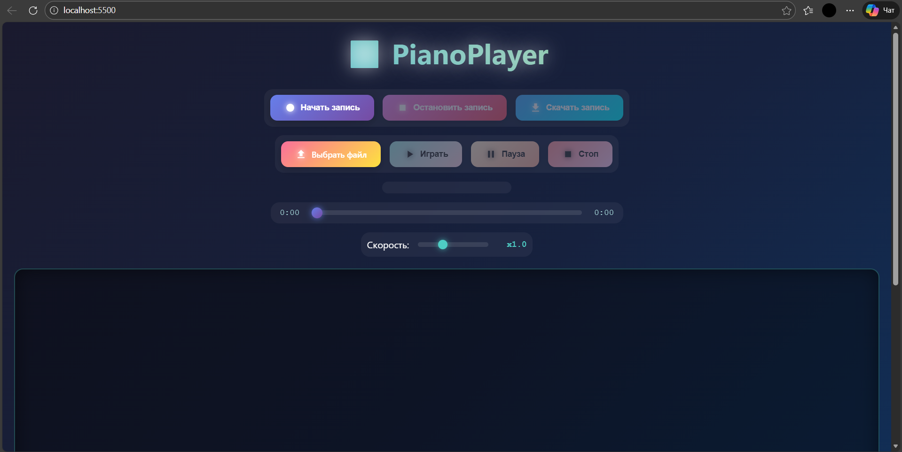

# 🎹 PianoPlayer

An interactive web application for playing virtual piano with recording and playback capabilities.




# npm and ESLint Setup
npm init -y - This will create a package.json file
npm install eslint --save-dev - Install ESLint

---

## ✨ Features

### 🎮 Interactive Playing
- **88 keys** (from A0 to C8) - full-featured piano
- **Mouse control**: 
  - Left and right mouse buttons
  - Glissando - slide your mouse over the keys with the button pressed
- **Keyboard control**: Play using your computer keyboard (see mapping below)
- **Realistic sounds**: Real piano samples

### 🎵 Recording and Playback
- **Recording mode**: Record your performances with precise timing
- **Export to JSON**: Save recordings to disk
- **Import melodies**: Load and play ready-made compositions
- **Playback controls**: Play, Pause, Stop
- **Speed adjustment**: From 0.5x to 2x
- **Interactive scrubbing**: Click on the progress bar to jump

### 🎨 Visualization
- **Key highlighting**: Synchronized with music
- **Falling notes**: Synthesia-style visualization
- **Modern design**: Gradients, neon effects, animations

---

## 🎹 Keyboard Mapping

Use the following keys to play:

| Key | Note | Key | Note | Key | Note |
|-----|------|-----|------|-----|------|
| Q | C3 | I | C4 | B | C5 |
| 2 | Db3 | 9 | Db4 | H | Db5 |
| W | D3 | O | D4 | N | D5 |
| 3 | Eb3 | 0 | Eb4 | J | Eb5 |
| E | E3 | P | E4 | M | E5 |
| R | F3 | Z | F4 | | |
| 5 | Gb3 | S | Gb4 | | |
| T | G3 | X | G4 | | |
| 6 | Ab3 | D | Ab4 | | |
| Y | A3 | C | A4 | | |
| 7 | Bb3 | F | Bb4 | | |
| U | B3 | V | B4 | | |

**White keys**: Q W E R T Y U I O P Z X C V B N M  
**Black keys**: 2 3 5 6 7 9 0 S D F H J

---

## 🚀 Installation and Setup

### Requirements
- Modern browser (Chrome, Firefox, Edge, Safari)
- Local web server (due to CORS policy for loading sounds)
- Node.js (for ESLint checking)

### Installation Steps

1. **Clone the repository**
```bash
git clone https://github.com/yourusername/piano-player.git
cd piano-player
```

2. **Install dependencies** (for ESLint)
```bash
npm install
```

3. **Start local server**

Option 1 - Python:
```bash
python3 -m http.server 8000
```

Option 2 - Node.js:
```bash
npx serve
```

Option 3 - VS Code:
- Install "Live Server" extension
- Right-click on `index.html` → "Open with Live Server"

4. **Open in browser**
```
http://localhost:8000
```

---

## 📁 Project Structure

```
piano-player/
├── 📁 sounds/           # Audio files (88 MP3s)
├── 📁 songs/            # JSON files with melodies (optional)
├── 📄 index.html        # Main page
├── 📄 style.css         # Styles
├── 📄 script.js         # Application logic
├── ⚙️ .eslintrc.json   # ESLint config
├── 📦 package.json      # npm config
├── 🔒 package-lock.json # Version lock
└── 📖 README.md         # Documentation
```

---

## 🎼 JSON File Format

Recordings are saved in the following format:

```json
{
  "name": "My Recording",
  "duration": 12500,
  "notes": [
    {
      "key": "C4",
      "startTime": 0,
      "duration": 500
    },
    {
      "key": "E4",
      "startTime": 500,
      "duration": 1000
    }
  ]
}
```

### Fields:
- `name` (string) - composition name
- `duration` (number) - total duration in milliseconds
- `notes` (array) - array of notes
  - `key` (string) - note (e.g., "C4", "Db5")
  - `startTime` (number) - start time in ms from the beginning of composition
  - `duration` (number) - note duration in ms

---

## 🛠️ Development

### Code checking (ESLint)
```bash
npm run lint
```

### Auto-fix
```bash
npm run lint -- --fix
```

### ESLint Rules
- `semi`: mandatory semicolons
- `no-console`: forbid console.log (for production)
- `no-unused-vars`: forbid unused variables
- `no-var`: use let/const instead of var
- `no-undef`: forbid undeclared variables

---

## 🎨 Technologies

- **HTML5** - application structure
- **CSS3** - modern design with gradients and animations
  - Flexbox for responsive layout
  - CSS Animations for smooth transitions
  - Glassmorphism effects
- **Vanilla JavaScript (ES6+)** - no frameworks
  - Web Audio API for sound playback
  - File API for working with files
  - RequestAnimationFrame for smooth animation

---

## 📱 Responsiveness

The application is adapted for various screens:
- 💻 Desktop (1920px+) - full functionality
- 💻 Laptop (1024px+) - optimized view
- 📱 Tablet (768px) - reduced keys
- 📱 Mobile (480px) - minimal version with scrolling

---

## 🎓 Learning Outcomes

This project demonstrates:
- **Web Audio API** - sound synthesis and playback
- **Event Handling** - keyboard and mouse events
- **File API** - JSON import/export
- **Canvas/DOM Animation** - falling notes visualization
- **State Management** - recording and playback modes
- **Responsive Design** - mobile-first approach

---

## 🚧 Constraints & Requirements

### ✅ Allowed
- Vanilla HTML, CSS, JavaScript
- Web Audio API
- File API
- Real audio samples (MP3)

### ❌ Not Allowed
- No frameworks (React, Vue, Angular)
- No external libraries (jQuery)
- No CDN imports

### 📋 Code Quality
- ✅ ESLint compliant
- ✅ No console errors
- ✅ No audio glitches
- ✅ Proper resource loading

**ESLint Configuration:**
```json
{
  "semi": "error",
  "no-console": "error",
  "no-unused-vars": "error",
  "no-var": "error",
  "no-undef": "error"
}
```

---

## 🔮 Future Improvements

- [ ] Add sustain pedal functionality
- [ ] Implement MIDI device support
- [ ] Add more instrument sounds
- [ ] Create sheet music display
- [ ] Add metronome
- [ ] Implement chord recognition
- [ ] Add recording editing tools
- [ ] Create song library
- [ ] Add multiplayer mode

---

## 🐛 Troubleshooting

### No sound playing
- Check if browser supports Web Audio API
- Ensure audio files are in `/sounds` folder
- Verify local server is running (CORS issue)
- Check browser console for errors

### Keys not responding
- Make sure page has focus
- Check if keyboard shortcuts are not conflicting
- Verify JavaScript is enabled

### Recording not working
- Check File API support
- Verify browser permissions
- Ensure pop-ups are not blocked

---

## 📝 License

This project is part of an educational curriculum.

---
## 📫 Contact

- 📧 Email: [makasheva003@mail.ru]
- 🌐 GitHub: [@aimakashe](https://github.com/aimakashe)
